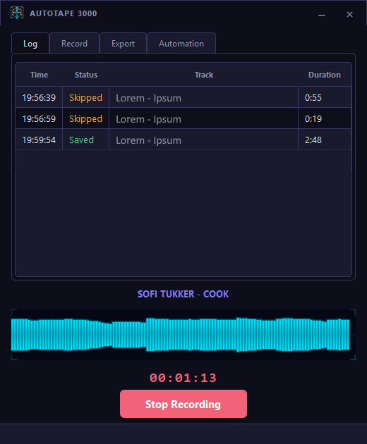

# Autotape 3000

A desktop audio recorder for Windows with media player auto-recording, real-time waveform visualization, and WAV-to-MP3 conversion.


<div align="center">
    
</div>

## Features

- **Audio recording** — capture from any input device (including virtual cables like VB-CABLE) with configurable sample rate, channels, and bit depth (16-bit, 24-bit, 32-bit float).
- **Media player auto-record** — automatically starts and stops recordings on track changes using the Windows Global System Media Transport Controls (GSMTC) API. Works with any GSMTC-registered media player. Each recording is named after the track being played.
- **WAV-to-MP3 conversion** — optional post-save conversion via LAME, with configurable bitrate (96–320 kbps) and quality presets. When using the Spotify Desktop App, MP3 files are tagged with artist, title, album, and cover art (ID3).
- **Cover art** — pulled automatically from the GSMTC thumbnail stream or manually selected via a fullscreen region picker.
- **Real-time waveform visualization** — displays a smooth, scrolling RMS waveform in real time during recording, providing immediate visual feedback on audio levels and activity.
- **Minimum duration filter** — recordings shorter than a configurable threshold are automatically discarded.
- **Persistent settings** — all settings are saved to `settings.json` and restored on next launch.
- **Frameless window** — custom title bar with native Aero Snap support.

## Requirements

- Windows 10 or later (GSMTC and WASAPI are Windows-only)
- Python 3.11+

## Installation

1. Clone or download the repository.

2. Install dependencies:

```bash
pip install -r requirements.txt
```

3. Run the application:

```bash
python main.py
```

## Project Structure

```
gravity/
├── main.py                  # Entry point
├── requirements.txt
├── settings.json            # Persisted settings (auto-generated)
├── core/
│   ├── recorder.py          # Audio capture (sounddevice / soundfile)
│   └── converter.py         # WAV-to-MP3 conversion (lameenc / mutagen)
├── gui/
│   ├── recorder_app.py      # Main application window (PyQt6)
│   ├── region_selector.py   # Fullscreen region picker overlay
│   ├── theme.py             # Color constants and Qt stylesheet
│   ├── titlebar.py          # Custom frameless title bar
│   └── waveform.py          # Real-time waveform widget
├── services/
    └── media_session.py     # GSMTC media session integration
└── utils/
    └── filename.py          # Filename sanitization helpers
```

## Usage

### Manual recording

1. Select an input device from the **Device** dropdown.
2. Configure sample rate, channels, and bit depth as needed.
3. Set an output file path.
4. Press **Record** to start and **Stop** to finish.

### Media player auto-record

1. Enable **Auto-record tracks** in the Media Player section.
2. Play music in any GSMTC-registered media player — the recorder starts and stops automatically with each track change, saving a file named after the current track.
3. Cover art is embedded automatically when available via GSMTC. Use **Pick region** as a fallback to manually select a screen area containing the album art.

### MP3 conversion

1. Check **Convert to MP3** in the Settings section.
2. Choose a bitrate and quality preset.
3. After each recording is saved as WAV it is converted to MP3, tagged, and the source WAV is removed.

## Recommended Setup:
 
 For the cleanest, most reliable audio capture from other applications, use a virtual audio cable driver such as [VB-CABLE](https://vb-audio.com/Cable/). VB-CABLE lets you route audio output from any program directly into Autotape 3000 as an input device. This ensures:
 
 - No background noise or microphone interference
 - No system sounds or notifications in your recordings
 - Bit-perfect digital audio transfer between apps
 
 **How to use:**
 1. Download and install VB-CABLE from the [official site](https://vb-audio.com/Cable/).
 2. Set your desired application's output to "CABLE Output" (the virtual cable).
 3. In Autotape 3000, select "CABLE Output" as the input device.
 4. Record as usual - only the routed application's audio will be captured.

## Dependencies

**Thank you to the authors and maintainers of these excellent open source libraries:**

| Package | Purpose |
|---|---|
| `sounddevice` | Audio input capture |
| `soundfile` | WAV file reading / writing |
| `numpy` | Audio buffer processing |
| `lameenc` | MP3 encoding via LAME |
| `mutagen` | ID3 tag writing |
| `PyQt6` | GUI framework |
| `Pillow` | Image handling and screen capture |
| `winrt-*` | Windows GSMTC (media player metadata / cover art) |

