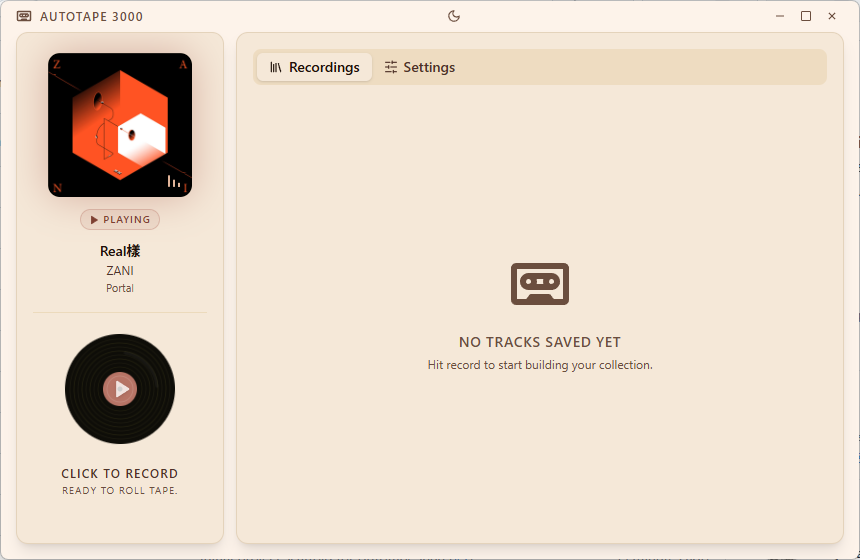
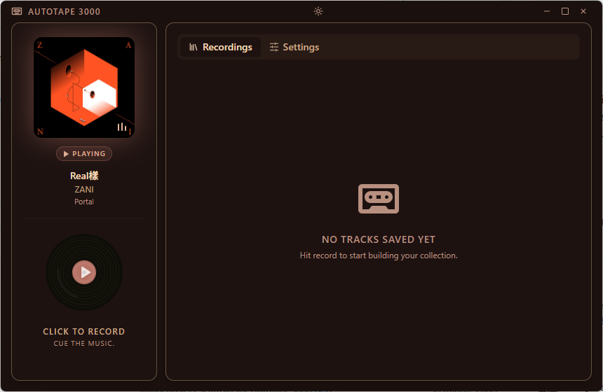
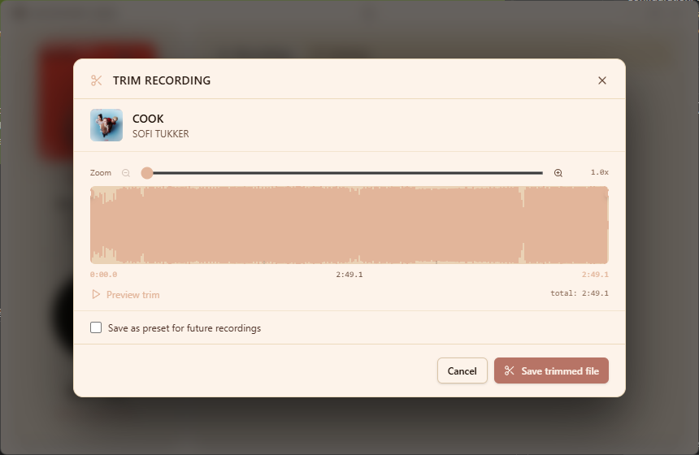

# Autotape 3000

| Light | Dark |
|-------|------|
|  |  |

A Windows desktop app that automatically records system audio on a per-track basis. It watches the Windows **Global System Media Transport Controls (GSMTC)** — the same API powering taskbar controls and browser media players — and silently splits recordings every time the track changes. Metadata (artist, title, album, cover art) is pulled directly from GSMTC, so the source app must expose this information for tagging to work.

> [!IMPORTANT]
> Windows 10 / 11 only. GSMTC and DirectShow audio capture are Windows-exclusive features.

---

## Features

- **Per-track recording** — starts and stops automatically on every track change; no manual splitting needed
- **Any GSMTC source** — popular music streaming apps, browser players, or anything else that exposes media controls
- **System audio capture** — captures directly from a DirectShow audio device via ffmpeg
- **Warm pre-roll recorder** — ffmpeg stays running in the background to eliminate spawn latency on track changes
- **ID3 metadata & album art** — artist, title, album, and cover art embedded automatically; untagged if the source doesn't expose metadata
- **MP3 and WAV output** — configurable format and bitrate (128–320 kbps)
- **Audio trimming** — drag-to-select waveform editor with per-song and global presets; re-encodes in place
- **Session filter** — lock recording to a specific source or follow whichever app is active
- **Duplicate handling** — skip, overwrite, or auto-increment filenames
- **Minimum save duration** — discard clips below a threshold you set

---

## Requirements

| Requirement | Notes |
|---|---|
| Windows 10 / 11 | GSMTC + DirectShow audio capture |
| ffmpeg | Bundled automatically; a system install is used as a fallback |

---

## Getting Started

1. Download the latest release from the [Releases](https://github.com/Chelyocarpus/autotape-3000/releases) page — `Autotape3000-setup.exe` for the installer or `Autotape3000-portable.exe` for the portable version (no install needed).
2. Run the installer or launch the portable executable — no admin rights required.
3. On first launch, a short setup wizard walks you through picking an audio device and output folder.
4. Hit the record button, then play music in any GSMTC-enabled app — recordings split automatically with each track change.

> [!NOTE]
> ffmpeg is bundled with the app. If the bundled binary fails, install [ffmpeg](https://ffmpeg.org/download.html) separately and point the app to it in **Settings → ffmpeg Binary**.

---

## Audio Device Setup

Autotape 3000 records from a DirectShow audio input device. To isolate music from the rest of your system audio (notifications, calls, browser tabs, etc.), route only your music app through a virtual audio cable and point Autotape 3000 at that device.

**Recommended: [VB-Cable Virtual Audio Device](https://vb-audio.com/Cable/)** (free)

1. Install VB-Cable and set **CABLE Output** as your default playback device in your music streaming app of choice.
2. In Autotape 3000, select **CABLE Output** as the audio device in Settings.
3. Audio played on your system will now be captured directly.

> [!TIP]
> If you want to hear audio while recording, enable "Listen to this device" on CABLE Output in Windows Sound settings, or use VB-Cable's companion app [VoiceMeeter](https://vb-audio.com/Voicemeeter/) for more flexible routing.

---

## Audio Trimming

Every recorded track can be trimmed after it has been saved. Open a track from the **Recording Log** to launch the waveform editor.



- **Drag to select** the region you want to keep directly on the waveform
- **Per-song presets** — save a trim range for a specific track and reuse it on re-encode
- **Global presets** — apply the same head/tail trim to every track (useful for consistent intros/outros)
- Re-encodes the file in place; the original is not kept

---

## Configuration

All settings are in the **Settings** tab:

| Setting | Default | Description |
|---|---|---|
| Output folder | `~/Music/Autotape 3000` | Where recordings are saved |
| Format | `mp3` | `mp3` or `wav` |
| Bitrate | `320 kbps` | MP3 only |
| Audio device | `default` | DirectShow capture device |
| Session filter | `auto` | Lock to one source or follow active media |
| Min save duration | `0 s` | Discard clips shorter than this |
| Duplicate action | `increment` | `skip`, `overwrite`, or `increment` |
| ffmpeg binary | _(auto)_ | Leave blank to auto-detect |

---

## Development
This is optional and not needed to run the app, but if you want to build from source or contribute, here are the instructions:

```bash
pnpm install      # install dependencies
pnpm dev          # start dev server with HMR
pnpm build:win    # build + package Windows installer → dist/
```

---

## Tech Stack

- [Electron](https://www.electronjs.org/) + [electron-vite](https://evite.netlify.app/)
- [React](https://react.dev/) 19 + [TypeScript](https://www.typescriptlang.org/)
- [Radix UI](https://www.radix-ui.com/) + [Tailwind CSS](https://tailwindcss.com/) v4
- [node-id3](https://github.com/Zazama/node-id3) — ID3 metadata tagging
- [@ffmpeg-installer/ffmpeg](https://www.npmjs.com/package/@ffmpeg-installer/ffmpeg) — bundled ffmpeg binary
- PowerShell + WinRT — GSMTC integration
